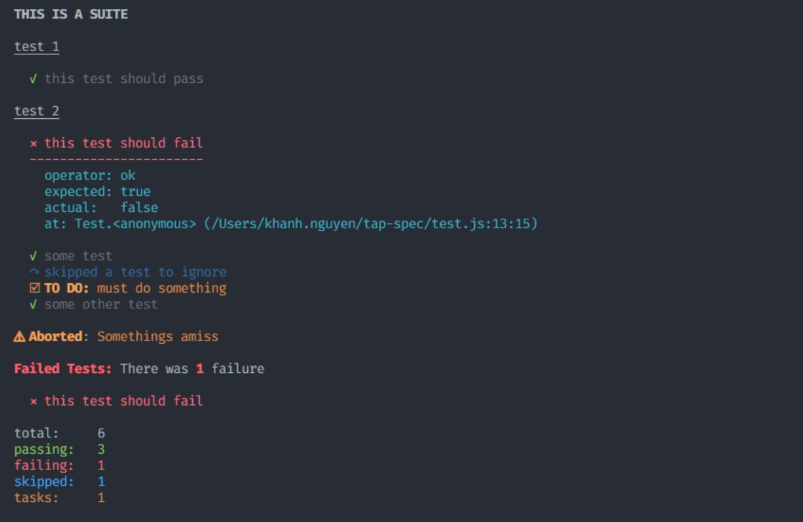

# QuikGo (qgo)

QuikGo is a development tool providing a simple workflow for building Go applications. It wraps go tools, providing a simple and consistent developer experience across projects and adds [support for a `manifest.json` or `package.json`](#automation).

Developers need to remember a few basic commands:

| Basic Command             | Description                                                  |
| ------------------------- | :----------------------------------------------------------- |
| [`qgo init`](#init)        | Initialize a new app.                                        |
| [`qgo run`](#run--build)   | Like `go run`, but reads configuration from JSON.          |
| [`qgo build`](#run--build) | Like `go build` but reads configuration from JSON.         |
| [`qgo test`](test)         | Run the test suite with TAP/formatted output (pretty tests). |

By simplifying the development environment, Go developers derive the following benefits:

- Automation
- Standards & Architecture
- Lower Mental Overhead

**INSTALLATION**

```sh
go install github.com/quikdev/go@latest
```

_Alternatively, download the latest binary release and add it to your `PATH`._

### Automation

`qgo` auto-constructs/runs commands using parameters found in a `manifest.json` (or `package.json`) file. This file exists in the same directory as your `go.mod` and `main.go`/`mymodule.go` files.

For example, consider the following `manifest.json` file:

```js
{
  "name": "demo",                               // Ouput name
  "version": "1.0.0",                           // Version number
  "description": "A simple test app.",          // Description
  "build": "main.go",                            // The source file to build

  "variables": {                                // Build-time variables provided to the app
    "main.name": "manifest.name",               // Dynamic reference to package.name above
    "main.version": "manifest.version",         // Dynamic reference to the package.version above
    "main.description": "manifest.description", // Dynamic reference to the package.description above
    "main.author": "env.USER"                   // Dynamic reference to the USER environment variable
  },

  "minify": true,                               // Applies common build techniques to reduce binary size

  "tags": [                                     // Tags to pass to the build process
    "a-tag",
    "b-tag"
  ],
  "verbose": true,                              // Verbose output (list modules)
  "cwd": "/path/to/root"                        // The current working directory of the app
}
```

Executing `qgo run` will generate and run the following command:

```sh
go build \
   -C .\path\to\root \
   -v \
   -ldflags " \
     -X 'main.name=demo' \
     -X 'main.version=1.0.0' \
     -X 'main.description=A simple test app.' \
     -X 'main.author=my_username' \
     -X 'buildTime=2023-10-05T23:35:27Z' \
     -c \
     -w \
     -s \
   " \
   -tags " \
      a-tag, \
      b-tag \
   " \
   -o .\bin\demo.exe \
   main.go \
&& .\bin\demo.exe
```

This command will build an executable called `demo` (specified in the JSON `name` attribute) from the `main.go` source file (specified in the JSON `build` attribute). If the `build` attribute is not defined in the JSON, qgo attempts to find the file with the `main()` function.

This example assumes several build variables exist in the main module (`description`, `name`, `version`, `buildTime`). The `buildTime` variable is always applied by `qgo` even though it is not in the `package.json` file. If your app does not use it, it is ignored. This command results in the execution of a binary built as though it were ready for distribution, simply by calling `qgo run`. Notice that some of the variable values in the `manifest.json` are `manifest.<attribute>`. These specify dynamically generated values found elsewhere in the package/manifest. The `package.` prefix is an alias for `manifest.` if you prefer to use `package.json` nomenclature. It is also possible to specify `env.<variable>` values, which will derive the attribute value from a local environment variable.

By leveraging a `package.json`/`manifest.json` file, these parameters can be committed alongside Go source code, allowing a portable/standard experience for building/running Go apps.

### Use Cases

#### Antivirus

Consider the standard `go run myapp.go` command. This produces a temporary executable with a unique filename before running the temporary executable. Windows Defender and other antivirus suites can block these temporary files, throwing `Access denied.` errors (often sporadically). Exceptions can be made to allow-list executables in these tools, but they expect the executable to have a consistent name. As a result, it is easier to run `go build myapp.go && myapp.exe` so `myapp.exe` can be allow-listed with the antivirus suite. This is not intuitive or easy to remember when you're used to just running `go run myapp.go`. Plus, it's annoying to take time specifically to allow-list a particular executable. Most developers bypass this by allowing all executables, which defeats the purpose of these protections.

**_For Windows Users_**

Typically, Windows will grant access after denying if the same file is explicitly run a few times. There are scenarios where you may need to exclude it from Windows Defender though.

To do this, navigate to `%ProgramFiles%\Windows Defender`, then run the following as Administrator:

```powershell
MpCmdRun.exe -AddDynamicSignature -Path C:\path\to\my.exe
```

Alternatively, use the GUI:

1. Open Windows Security.
1. Go to Virus & threat protection.
1. Under Exclusions, select Add or remove exclusions.
1. Select Add an exclusion, and choose the file you want to exclude.

#### Versioning

Next, consider `go build -ldflags "-X 'main.version=1.0.0'" myapp.go && myapp.exe`. Dynamically specifying a version number (as opposed to hard-coding) is a common development need, which is easily solved using ldflags. This isn't something you want to type over and over though. Automating this delegates the versioning logic to the manifest file, so you only need to run `qgo build` instead of this big command.

# Commands

## Init

The `init` command provides a simple wizard to setup a new Go project. It will generate the appropriate `go.mod`, `go.work`, `manifest.json`, `README.md`, a license file, and starter code with unit tests. The wizard provides options to generate projects with the [recommended code layouts](https://go.dev/doc/modules/layout#package-or-command-with-supporting-packages) laid out by the Go team. It can also configure your git repo (optional).

```sh
Usage: qgo init

Setup a new Go module or application

Flags:
  -h, --help         Show context-sensitive help.
  -v, --version      Display the QuikGo version.
  -o, --overwrite    If a project already exist, overwrite with no backup
                     and no prompt.
```

## Run & Build

The build & run commands are the same. They both build the executable. Run attempts to run the program after the build completes.

```sh
Usage: qgo build [<file>]

Build the Go application

Arguments:
  [<file>]    Go source file (ex: main.go)

Flags:
  -h, --help                 Show context-sensitive help.
  -v, --version              Display the QuikGo version.
  -b, --bundle=BUNDLE,...    Bundle the application into a tarball/zipball
      --os=OS,...            The operating system(s) to build for
                             (any options from 'go tool dist list' is valid)
      --wasm                 Output a web assembly (OS is ignored when
                             this option is true)
  -o, --output=STRING        Output file name
  -t, --tips                 Display tips in the generated commands
  -m, --minify               Set ldflags to strip debugging symbols and
                             remove DWARF generations
  -s, --shrink               Set gccgoflags to strip debugging symbols and
                             remove DWARF generations
  -c, --compress             Compress with UPX
  -d, --dry-run              Display the command without executing it.
      --nowork               Set GOWORK=off when building
  -u, --update               Update (go mod tidy) before building.
```

Both qgo commands output the `go` command being run, providing full transparency into what is happening on your computer. This command can be copied/pasted to run it directly. For example:

```sh
Using package.json configuration

go build \
   -C .\path\to\root \
   -v \
   -ldflags " \
     -X 'main.name=demo' \
     -X 'main.version=1.0.0' \
     -X 'main.description=A simple test app.' \
     -X 'main.buildTime=2023-10-05T23:35:27Z' \
   " \
   -tags " \
      a-tag, \
      b-tag \
   " \
   -o .\bin\demo.exe \
   main.go \
&& .\bin\demo.exe // this line only exists for `qgo run`
```

An optional `-t` flag adds tooltips to the output command. For example:

```sh
go build \
   -v (print package names as they are compiled) \
   -ldflags (link arguments to go tool) " \
     -X 'main.name=Demo' \
     -X 'main.version=1.0.0' \
     -X 'main.description=A simple test app.' \
     -X 'main.buildTime=2024-02-17T05:17:32Z' \
   " \
   -o(utput) "./\bin\test.exe" \
   app.go (input file)
```

An optional `-d` flag (dry-run) outputs the command without running it.

For other flags, use `--help`.

## Test

```sh
Usage: qgo test

Run unit tests

Flags:
  -h, --help             Show context-sensitive help.
  -v, --version          Display the QuikGo version.
  -f, --format="spec"    The format to diplay test results in. Defaults to
                         'spec', a TAP visualizer. Options include 'tap',
                         'spec', 'json', and 'go' (i.e. go test standard)
```

The test command will run the test suite(s) the same way `go test` would, with a few differences. By default, test results will be converted to [TAP](https://testanything.org) format and output with pretty-printing (spec format).

> _The screen captures were taken from a JavaScript project formatted with [tapfmt](https://github.com/coreybutler/tapfmt), which is the underlying TAP formatting engine used in qgo._



Pretty-printing can be disabled if you prefer to use an alternative TAP renderer. The raw format would be available as:

```
TAP version 14
# THIS IS A SUITE
# test 1
ok 1 this test should pass
Bail out! Somethings amiss
# test 2
not ok 2 this test should fail
  ---
    operator: ok
    expected: true
    actual:   false
    at: Test.<anonymous> (/Users/khanh.nguyen/tap-spec/test.js:13:15)
  ...
ok 3 some test
not ok 4 # skip a test to ignore
ok 5 # todo must do something
ok 6 some other test
1..6
```

It is also possible to ignore the TAP conversion to leverage the standard go output format (`qgo test -f go`), or to specify JSON (`qgo test -f json`).

These settings can be configured in the `package.json`/`manifest.json` files under the `test` attribute:

```js
{
  "test": {
    "format": "none|tap|tap13|spec|json", // spec is the pretty output/default
    "debug": true|false                   // run tests with debugging turned on
  }
}
```

---

Copyright &copy; 2024, Author Software, Inc. and collaborators.
